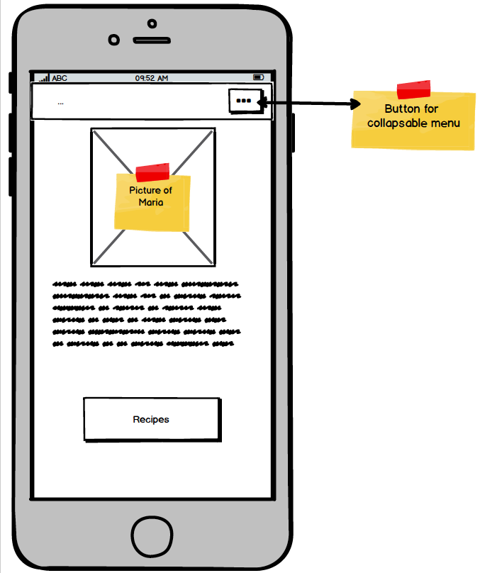
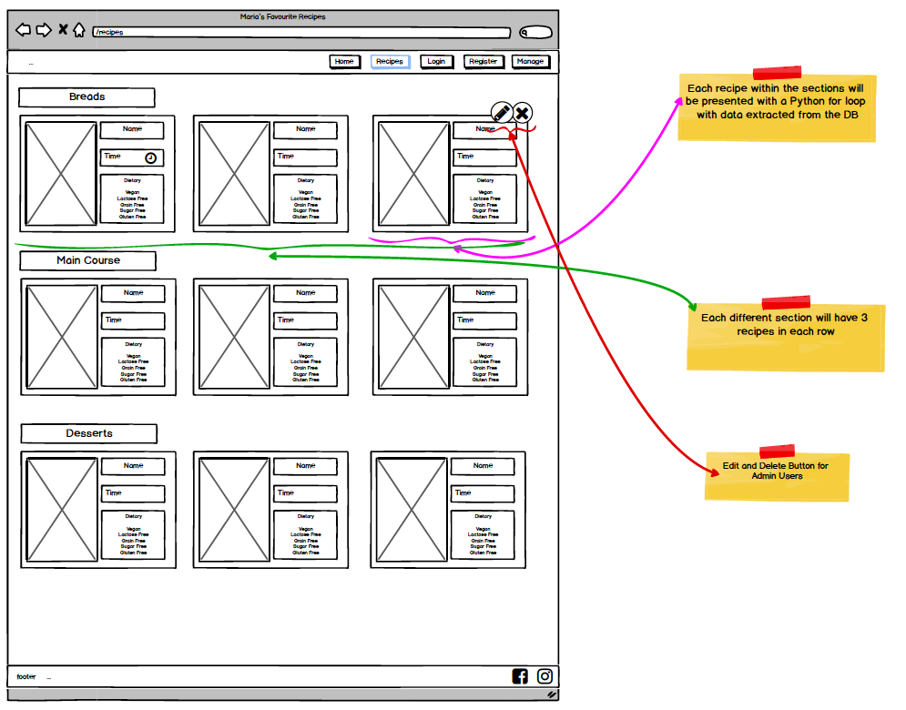
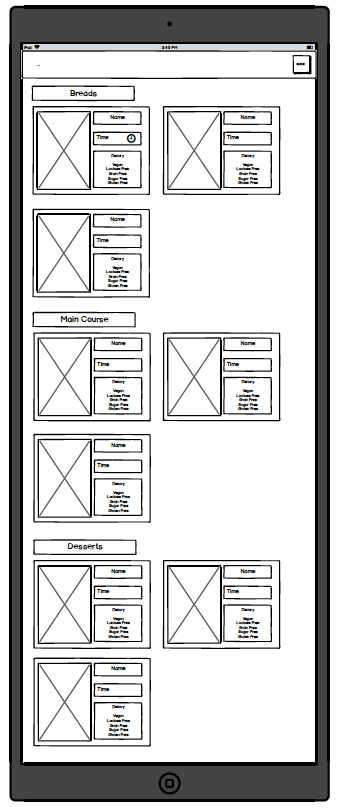
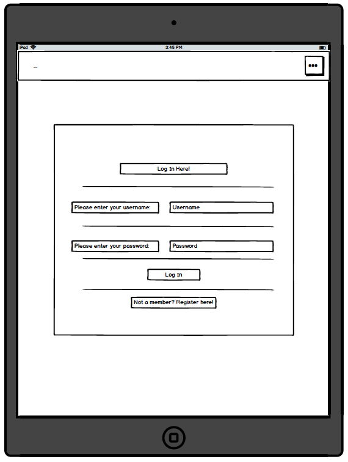

# Maria's Favourite Recipes! - Milestone Project 3

A site that allows users to add their own recipes to be viewed publicly!

To view the live version of the site, please click [here](https://ms3-maria-recipe-site.herokuapp.com/)

---

## UX Design

### User Stories

*First Time Users*

- As a first time user, I would like to be able to easily navigate to the recipes.
  - I have achieved this by having a button on index.html that will take the user to the recipes page. There is also a clear description of where the button will take the user.
- As a first time user, I would like to easily see whats the story behind the page.
  - I have achieved this by having a small background story about Maria and her healthy eating journey on index.html.
- As a first time user, I would like to be told how I can add my own recipes.
  - I have achieved this by indicating on the index.html that the user is able to add recipes to the page by registering a profile, once the user has registered their profile then they're redirected to my_recipes.html where they will see the 'Add New Recipe' button.

*Returning Users*

- As a returning user, I would like to see all of my own recipes seperate from other users.
  - I have achieved this by creating the 'my_profile.html' page. This page consists of all of the recipes that are created by the session user. 

*Admin Users*

- As an Admin User, I want total control of all recipes on the page (To edit and delete recipes added by other users).
  - I have achieved this by creating a profile under 'Maria'. On recipes.html, Maria is able to click a button 'Recipe Editor' and then will be able to edit or delete any recipe within the database. Other users have this functionality but its restricted to their own profile page. 

### Wireframes

- Home Page
  - Desktop

  

  - Tablet

  

  - Tablet - nav

  

  - Mobile

  

  - Mobile - nav

  

- Recipes
  - Desktop

  
  - Tablet

  
  - Mobile

  

- Login
  - Desktop

  
  - Tablet 
  
  
  - Mobile

  

- Register 
  - Desktop 

  
  - Tablet 

  
  - Mobile 

  

- Add Recipe Form 

  

---

# Features

- Recipes

  - Unregistered users are able to view all recipes that have been uploaded by registered users. This is achieved by a button on the home page that once clicked, will take them to 'recipes.html'.

  - Recipes are presented in rows of 3 on large devices, rows of 2 on tablets, and rows of 1 on mobile and are displayed to the user with an image, the name of, cooking time, servings info, a short description and a link to the full recipe.

  - Admin Users (Maria), will be able to delete or edit the data of recipes entered by all users, whereas everyone else will only be able to edit or delete their own.

- Register/Login 
  
  - A user will need to register a profile to be able to add any recipes, this infomation is on index.html.

  - If a user tries to register a username which is used by someone else already, they will not be allowed to use that username. The user will be notified of this by use of Flash Messages - "Username already exists!".

  - When a user has successfully registered their new profile, they will be redirected to 'my_recipes.html'.

  - When a returning user logs in successfully, they will also be redirected to 'my_recipes.html'.

  - If a user puts their infomation in incorrectly, they will be notified by the use of Flash Messages - "Incorrect Username and/or Password".

- Full Recipes

  - When users are viewing the basic recipe view on recipes.html, they are offered to take a look at the 'Full Recipe'. Once clicked, the users are presented with all of the data related to their chosen recipe, which is kept on MongoDB.

  - Once users are finished with the page, they will be able to go back by clicking the Back button at the foot of the recipe.

- My Recipes 

  - Upon registering/loggin in, the user will be greeted with the profile page(my_recipes.html)

  - Users here will be shown two buttons - 'Recipe Editor' and 'Add New Recipe' (See more details of these below).

  - The 'Add New Recipe' button will redirect the users to the form template that the users will need to fill out to add their recipes. 

  - Once the user has added a recipe, they will see it on their profile page. 

- Add Recipe
  
  - When users are adding a new recipe to their profile, they are guided through with notifications of what to do and requirements. 

  - The form will not be able to be submitted with any boxes not filled out by the user as to prevent any errors with the full recipe data, the user will be notified as the required attribute has been added.

- Recipe Editor

  - If users ever decide that they would like to edit any of the data or delete the entire recipe, all they need do is click on the Recipe Editor Button! This button will reveal two buttons underneath all of their inputted recipes. 

  - The green button has a notepad and pen icon, I decided on this image as it clearly is an indicator to some editing functionality.

  - The red button has a cross in circle icon, as above, I have used this icon and color as it is a clear indicator to deleting the recipe.

  - When the user tries to delete a recipe, they will be asked to confirm if that is what they want to do by means of a confirmation message. This is to prevent any user to delete a recipe by mistake. 

# Features Left to Impliment

1 - The 'Recipe Editor' and 'Add New Recipe' buttons are hidden by sidebar button or muteable someway should the user wish to only see their own recipes.

2 - More in depth registration form asking user for more credentials such as first and last name which could later be used visually.

3 - When adding a new recipe, having a checkbox form for 'Dietary Information' with values such as Vegan, Keto, Gluten Free ect. and 'Other: ...' text area.

--- 

# Technologies Used 

- [HTML5](https://en.wikipedia.org/wiki/HTML)
  - To give the page its structure and presenting static data.
  - All HTML files are located within the 'templates' directory.

- [CSS](https://en.wikipedia.org/wiki/CSS)
  - CSS has been used to style and customise the content of this project.

- [Materialize](https://materializecss.com/)
  - This is a framework that I have used to simplify CSS classes, features that have been used and modified include the navbar, responsive design classes, and colors for backgrounds and text.
  

- [JQuery](https://en.wikipedia.org/wiki/JQuery)
  - JQuery has been used to give the site its functionality as well as making DOM manipulation simpler.
  - Pages that include functionality are:
    - recipes.html for Admin users only
    - my_recipes.html for all users
    - add_recipe.html for all users

- [MongoDB](https://en.wikipedia.org/wiki/MongoDB) 
  - As the data entered by users can always be different from one to the next, the project uses MongoDB to store its data as MongoDB is a Document Based Database.

- [Flask](https://en.wikipedia.org/wiki/Flask_(web_framework))
  - Flask is a framework that allows developers to easily present data in an orderly fashion. All data entered by a user, such as the Recipe Name, is presented to users with a few lines of code embedded into the HTML.
  - Modules from Flask that have been included are:
    - Flask
    - flash
    - render_template
    - redirect
    - request
    - session
    - url_for
    - jsonify

- [Python](https://en.wikipedia.org/wiki/Python_(programming_language))
  - Python is working very closely with Flask to manipulate data and HTML across multiple pages within the app.

- [Heroku](https://en.wikipedia.org/wiki/Heroku)
  - Heroku has been used to deploy and host the app as it meets the need of being able to handle python.

- [Google Fonts](https://fonts.google.com/specimen/Abel?query=Abel)
  - The font I have used for this project is called Abel.

--- 

# Testing 

## Register.html

- Test 1 - Register - Test Passed ✓ 
  - Step 1 - From the home page, click the register button - located in the navbar (hidden by Burger Icon for mobile and tablet).
  - Step 2 - Put in a username which is unique (5 character minimum).
  - Step 3 - Put in a password (also 5 character minimum).
  - Step 4 - Click 'Register' button.
  - Step 5 - Be redirected to 'my_recipes.html'

- Test 2 - Register with a username which already exists - Test Passed ✓ 
  - Step 1 - While on 'register.html', enter username 'maria'.
  - Step 2 - Enter password (5 character minimum).
  - Step 3 - Click the 'Register' button.
  - Step 4 - Be presented by flash message containing "Username already exists!".

- Test 3 - Register with less than 5 characters - Test Passed ✓
  - Step 1 - While on 'register.html', enter username '1234'..
  - Step 2 - Enter password '1234'.
  - Step 3 - As the 'Required' and minlength=5 has been added, the form will not be submitted.
  - Step 4 - Change username and password to '12345' and form will submit. (Although matching usernames and passwords are never recommended! haha).

## Login.html

- Test 1 - Log In - Test Passed ✓
  - Step 1 - Enter your Username.
  - Step 2 - Enter your Password.
  - Step 3 - Click the 'log in' buttton.
  - Step 4 - Be redirected to 'my_recipes.html' with flash message containing "Welcome, [ user ]".

- Test 2 - Log in attempt with incorrect info - Test Passed ✓
  - Step 1 - Enter credentials that are incorrect.  
  - Step 2 - Click the 'log in' button.
  - Step 3 - Be redirected to the log in page with a flash message containing "Incorrect Username and/or Password".

## Adding a New Recipe 

- Test 1 - Adding a New Recipe - Test Passed ✓
  - Step 1 - Log In.
  - Step 2 - Be redirected to my_recipes.
  - Step 3 - Click button labeled 'ADD NEW RECIPE'.
  - Step 4 - Be redirected to the form for user to fill in.
  - Step 4.33 - Form is tried to be submitted with empty fields and fails and user is notified of missing items.
  - Step 4.66 - There are 2 form fields that can be empty and the form still successfully post. They are 'Comments' and 'Pre-Heat Oven'.
  - Step 5 - Once the form is filled out to the satsfaction of the constraints, the user will click the 'Add New Recipe!' button.
  - Step 6 - Be redirected to 'my_recipes.html' where the user can see their newly inputted recipe located underneath the dish category heading that the user selected in the form prior.
  - Step 7 - Check the contents of the newly added recipe right away by clicking the 'Full Recipe" link located within the recipe tile.
  - Step 8 - Be redirected to 'full_recipe.html' and have all data presented in a user-friendly fashoin.

## Editing/Deleting a Recipe 

- Test 1 - Editing a Recipe - Test Passed ✓
  - Step 1 - Navigate to my_recipes.
  - Step 2 - Click the button labeled "RECIPE EDITOR".
  - Step 3 - Navitgate to the recipe that the user wishes to edit, note - the user can only edit their own recipes.
  - Step 4 - Click on the green circle button.
  - Step 5 - Be redirected to edit_recipe.html. This is a copy of the 'add recipe' form with all of the fields already populated, ready for the user to edit.
  - Step 6 - Should the user wish to cancel the action, they can click on the canel button located on bottom right. 
    - Step 6.5 - If you click cancel, then you will be redirected to my_recipes and all changes will be disregarded. 
  - Step 7 - Once the user has made their changes to the recipe, they will click 'UPDATE RECIPE".
  - Step 8 - Be redirected to my_recipes

- Test 2 - Deleting a Recipe - Test Passed ✓
  - Step 1 - Navigate to my_recipes.
  - Step 2 - Click the button labeled "RECIPE EDITOR".
  - Step 3 - User navigates to recipe which they would like to delete.
  - Step 4 - User clicks red circle button.
  - Step 5 - Recipe is deleted, user is redirected to my_recipes.

## Admin Capability

- Test 1 - Edit any Recipe - Test Passed ✓ 
  - Step 1 - Navigate to recipes.html as admin.
  - Step 2 - Click the 'RECIPE EDITOR' button.
  - Step 3 - Edit the recipe as user sees fit.
  - Step 4 - Click "UPDATE RECIPE".
  - Step 5 - Be redirected to recipes.html.

- Test 2 - Delete any Recipe - Test Passed ✓
  - Step 1 - Navigate to my_recipes.
  - Step 2 - Click the button labeled "RECIPE EDITOR".
  - Step 3 - User navigates to recipe which they would like to delete.
  - Step 4 - User clicks red circle button.
  - Step 5 - Recipe is deleted, user is redirected to my_recipes.

---
## Validators

The validators that have been used on the project are as followed:
 
  - [HTML Validator](https://validator.w3.org/nu/) - No issues apart from jinja templating
  - [CSS Validator](https://jigsaw.w3.org/css-validator/) - No issues
  - [JavaScript Validator](https://jshint.com/) - No issues 
  - [Python Validator](http://pep8online.com/) - No issues

---

# Deployment 

For the project to successfully deploy, the following are requirements are needed:

- Python
- Github account or similar IDE 
- MongoDB
- Heroku 

### **Cloning the Project**
  - Step 1 - log in to your github account and go to the repository.
  - Step 2 - Click on 'Code'.
  - Step 3 - Click the link to copy
  - step 4 - Within the gitpod/IDE type 'GIT CLONE' into the terminal followed by the link and press enter.

### **Heroku Deployment**
  - Step 1 - Within the terminal, type 'pip freeze > requirements.txt' - this command will generate a .txt file with all of the requirements necessary for Heroku to run the app.
  - Step 2 - Within the terminal, type 'echo web: python app.py > Procfile' - This tells Heroku that this is a web based app.
  - Step 3 - Assuming you have an account, log in to Heroku and set up a new app with the region that is closest to you (Europe/America).
  - Step 4 - You will need to set up your own config vars both on Heroku and within env.py for the app to access the data properly, these will include:
    - IP 
    - PORT 
    - SECRET_KEY
    - MONGO_URI
    - MONGO_DBNAME
  - Step 5 - Select deploy method of choice. I have set up Automatic Deployments by connecting to my github account and enabled automatic deployments from the master branch

  ---

# Credits 
### Recipes

All recipes currently on the page have all been added my Maria herself

### Recipe Images 
All images used on the page are linked below:
- Almond Flour Buns
  - https://www.bakingmad.com/BakingMad/media/content/Recipes/Bread-Dough/Easy-wholemeal-bread-rolls/1-Wholegrain-bread-rolls-WEB.jpg

- Naan Bread 
  - https://www.jocooks.com/wp-content/uploads/2011/04/naan-bread-1-500x500.jpg

- Carrot Burgers
  - https://www.rachaelraymag.com/.image/ar_1:1%2Cc_fill%2Ccs_srgb%2Cfl_progressive%2Cq_auto:good%2Cw_1200/MTQzMjU4OTI2NzU1MDMwODk0/carrot-top-burgers.jpg

- Cheesecake
  - https://www.californiastrawberries.com/wp-content/uploads/2018/07/Strawberry-No-Bake-Cheesecake_1024x1024.png

- Raw Balls
  - https://www.theflavorbender.com/wp-content/uploads/2014/09/Chia-Bliss-Balls-Featured-4.jpg
  
- Cheese Nachos
  - https://www.wholesomeyum.com/wp-content/uploads/2016/05/wholesomeyum-low-carb-keto-nachos-recipe-with-spicy-chicken-26.jpg
  
- Bruschetta 
  - https://www.jessicagavin.com/wp-content/uploads/2020/07/bruschetta-17-1200.jpg
  
- Roasted Cauliflower
  -  https://minimalistbaker.com/wp-content/uploads/2018/07/How-to-roast-cauliflower-SQUARE.jpg

- Pear Cake
  - https://marisasitaliankitchen.com/wp-content/uploads/2019/09/Pear-Honey-Rosemary-Bundt-Cake-7-of-10-500x500.jpg

- Cauliflower Pizza
  - https://realhousemoms.com/wp-content/uploads/Cauliflower-Pizza-Crust-IG1.jpg

### Materialize
For this project, I have used and modified content from the Materialize Docs. Aspects include:
  - Navbar 
  - Color classes 
  - JQuery Initialization
  - Card

### Font Awesome 
- Icons used on this site have been taken from [font awesome](https://fontawesome.com/).

### Google Fonts 
- The font family used on this site is called Abel and can be seen [here](https://fonts.google.com/?query=abel)

#### This project is purely educational, please contact me if there are any issues with Copyright.
leesheppard2404@gmail.com